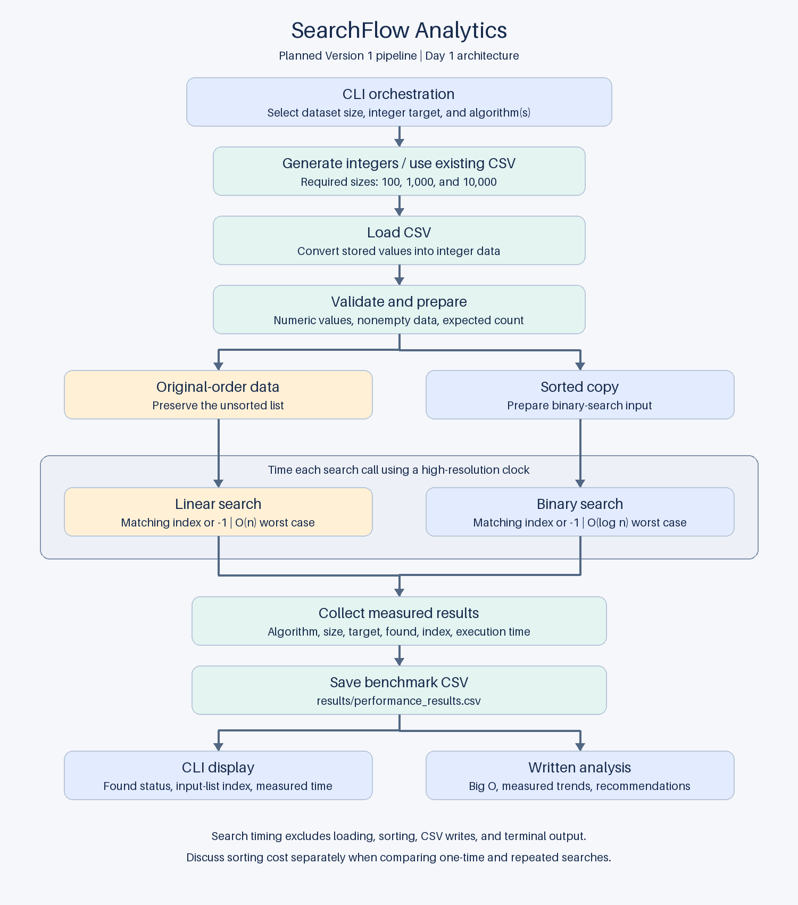

# SearchFlow Analytics

A Python portfolio project for comparing linear and binary search in a local
CSV data-processing pipeline. The planned Version 1 release is `v1.0.0`.

## Current status

Days 1–6 are complete: data preparation, linear/binary search, measured
benchmarks, an interactive search menu, and validated analysis. `main.py` opens
the menu by default; batch commands support previewing, generation, and benchmark
export. Read the [Big O analysis](docs/big_o_analysis.md) and
[algorithm recommendation guide](docs/recommendation_guide.md). Day 7 final
submission checks, screenshots, and release remain pending.

## Objectives

- Generate and validate datasets containing 100, 1,000, and 10,000 integers.
- Compare linear search on unsorted data with binary search on a sorted copy.
- Measure actual execution times and save benchmark results to CSV.
- Explain O(n) versus O(log n), including sorting costs and usage recommendations.

## Setup

Use Python 3.10 or newer. Days 1–6 were verified locally with Python 3.14.4.
Run these commands from the repository root in PowerShell:

```powershell
python -m venv .venv
.\.venv\Scripts\python.exe -m pip install -r requirements.txt
.\.venv\Scripts\python.exe main.py
```

Calling the environment's interpreter directly does not require activation or
changes to PowerShell's execution policy. On macOS/Linux, use
`.venv/bin/python` after creating the environment with `python3 -m venv .venv`.

The three datasets are already included. The menu prompts for a dataset size,
integer target, and linear search, binary search, or both:

```text
Select Dataset Size
1. 100
2. 1,000
3. 10,000
Enter option (q to quit):
```

For a quick example, choose `1`, enter `83810`, then choose `3` to compare both.
The included 100-value dataset returns linear index `0` and binary index `82`;
indexes refer to original-order and sorted data respectively. Times are measured
live and vary between runs. Each result shows found status, index, and seconds
per search. The next dataset menu starts another search.

Enter `q` at any prompt to exit. Blank/invalid choices and noninteger targets
are re-prompted; zero and negative integer targets are valid. EOF or Ctrl+C
ends the session cleanly. File/data errors return to the dataset menu, allowing
another selection. Interactive searches display results without changing datasets
or overwriting saved benchmark files.

To use the previous non-interactive data preview:

```powershell
.\.venv\Scripts\python.exe main.py --preview
```

To regenerate all three CSV files with seed `42`, replacing their current contents:

```powershell
.\.venv\Scripts\python.exe main.py --generate
```

`--generate` alone regenerates and previews without prompting. Combine it with
`--interactive` to open the menu afterward, or `--benchmark` to measure afterward.
The explicit action flags `--interactive`, `--preview`, and `--benchmark` are
mutually exclusive. Resource paths are based on the project location, so commands
also work when launched from another directory.

Batch file/data errors return a nonzero exit code. Interactive file errors
allow recovery within the menu; `q`, EOF, and Ctrl+C exit the session with status 0.
See [dataset format and reproducibility](data/README.md) for the data contract.

The application and tests use the Python standard library (`csv`,
`random`, `pathlib`, `time`, `statistics`, and `unittest`); no third-party runtime
packages are currently required.

## Benchmarks

Measure both searches at all three sizes and replace the saved benchmark files:

```powershell
.\.venv\Scripts\python.exe main.py --benchmark
```

Each run records 24 rows: three dataset sizes, four target cases, and two
algorithms. Defaults are seven batches of 100 searches, three warm-up calls,
and the median batch average in **seconds per search**. Customize with:

```powershell
.\.venv\Scripts\python.exe main.py --benchmark --repeats 9 --iterations 200 --warmups 5
```

`--generate --benchmark` regenerates the seeded datasets before measuring.
Timing options require `--benchmark`; the interactive menu uses the documented
default settings. Invalid benchmark settings are rejected before regeneration
or measurement begins.

- [performance_results.csv](results/performance_results.csv): the required
  `algorithm,dataset_size,target,found,index,execution_time` columns.
- [benchmark_metadata.json](results/benchmark_metadata.json): settings, raw
  samples, case-to-row mapping, separate sorting times, environment, and hashes.
- [Benchmark methodology](docs/benchmark_methodology.md): timing boundaries,
  target selection, interpretation, and the recorded run summary.

In the captured Day 4 run, linear search was faster for the first original
value; binary search was faster for missing targets. Search-only timings do
not include sorting cost and do not establish that one algorithm is always best.

## Search examples

From the repository root, start Python with `.\.venv\Scripts\python.exe`, then:

```python
from src.linear_search import linear_search
from src.binary_search import binary_search
from src.data_processor import prepare_search_data

original, ordered = prepare_search_data([7, 2, 9, 4])
print(linear_search(original, 9))  # 2, in original order
print(binary_search(ordered, 9))  # 3, in [2, 4, 7, 9]
print(linear_search(original, 99))  # -1
print(binary_search(ordered, 99))  # -1
```

Both functions return a zero-based matching index or `-1`, leave inputs
unchanged, and return `-1` for empty sequences. Test `index != -1` for a match;
index `0` is a valid result.

| Algorithm | Input | Duplicates | Time / extra space |
| --- | --- | --- | --- |
| Linear search | Validated integers in any order | First matching index | Best O(1), average/worst O(n); O(1) space |
| Binary search | Validated integers sorted ascending | Any matching index | Best O(1), average/worst O(log n); O(1) space |

Binary search assumes a list or tuple with constant-time indexing. It does not
sort or scan to check ordering inside the search. Use the sorted output of
`prepare_search_data` and validate at the pipeline boundary before searching.
The two algorithms may return different indexes for the same value. Sorting
cost is separate from the search complexities above.

## Architecture



The CLI coordinates loading, validation, the original/sorted branches, timed
searches, and result display. Full benchmark runs also export CSV and metadata.
Written analysis will use the measured results. See
[architecture and contracts](docs/architecture.md).

## Repository structure

```text
searchflow-analytics/
|-- main.py                  # Interactive menu and batch command routing
|-- requirements.txt         # Runtime dependencies
|-- .gitignore
|-- src/
|   |-- __init__.py
|   |-- data_generator.py
|   |-- data_loader.py
|   |-- data_processor.py
|   |-- linear_search.py
|   |-- binary_search.py
|   |-- performance_timer.py
|   |-- results_manager.py
|   |-- benchmark.py
|   `-- cli.py
|-- data/                   # README and generated 100/1,000/10,000-value CSV files
|-- results/                # Measured benchmark CSV and run metadata
|-- tests/
|   |-- test_data_pipeline.py
|   |-- test_linear_search.py
|   |-- test_binary_search.py
|   |-- test_performance_timer.py
|   |-- test_results_manager.py
|   |-- test_benchmark.py
|   `-- test_cli.py
|-- docs/
|   |-- requirements.md
|   |-- architecture.md
|   |-- day_1_checklist.md
|   |-- day_2_checklist.md
|   |-- day_3_checklist.md
|   |-- day_4_checklist.md
|   |-- day_5_checklist.md
|   |-- day_6_checklist.md
|   |-- big_o_analysis.md
|   |-- recommendation_guide.md
|   |-- benchmark_methodology.md
|   `-- screenshots/         # Working application captures on Day 7
`-- diagrams/
    |-- render_architecture.py
    `-- pipeline_architecture.png
```

Future module names and responsibilities are recorded in the architecture
document. Empty output directories are retained with `.gitkeep` files.

## Validation

Run the data pipeline and search tests from the repository root:

```powershell
.\.venv\Scripts\python.exe -m unittest discover -s tests -v
```

All 73 tests pass. Coverage includes data preparation, search correctness,
binary-search work bounds, timing arithmetic and boundaries, CSV validation,
benchmark metadata, all required sizes, and interactive input/recovery/exit
behavior. The menu is also checked through a real piped terminal session from
the parent directory, with dataset/result files unchanged. Controlled
clocks are used only in timer unit tests; published benchmark values come from
actual calls to `time.perf_counter()`.

## Delivery plan

| Day | Deliverable |
| --- | --- |
| 1 — complete | Environment, requirements, structure, architecture |
| 2 — complete | Dataset generation, loading, validation, sorted copies |
| 3 — complete | Linear and binary search |
| 4 — complete | Timing and benchmark CSV |
| 5 — complete | Interactive CLI and integration |
| 6 — complete | Test coverage audit, Big O analysis, recommendation guide |
| 7 | Final validation, screenshots, README, `v1.0.0` release |

See [Version 1 requirements](docs/requirements.md) and the
[Day 6 quality gate](docs/day_6_checklist.md). The
[Day 1](docs/day_1_checklist.md), [Day 2](docs/day_2_checklist.md),
[Day 3](docs/day_3_checklist.md), [Day 4](docs/day_4_checklist.md), and
[Day 5](docs/day_5_checklist.md) quality gates
are retained as historical records.
This version stays local:
cloud deployment, databases, APIs, containers, orchestration, CI/CD,
authentication, web dashboards, distributed processing, and advanced search
algorithms are outside its scope.
